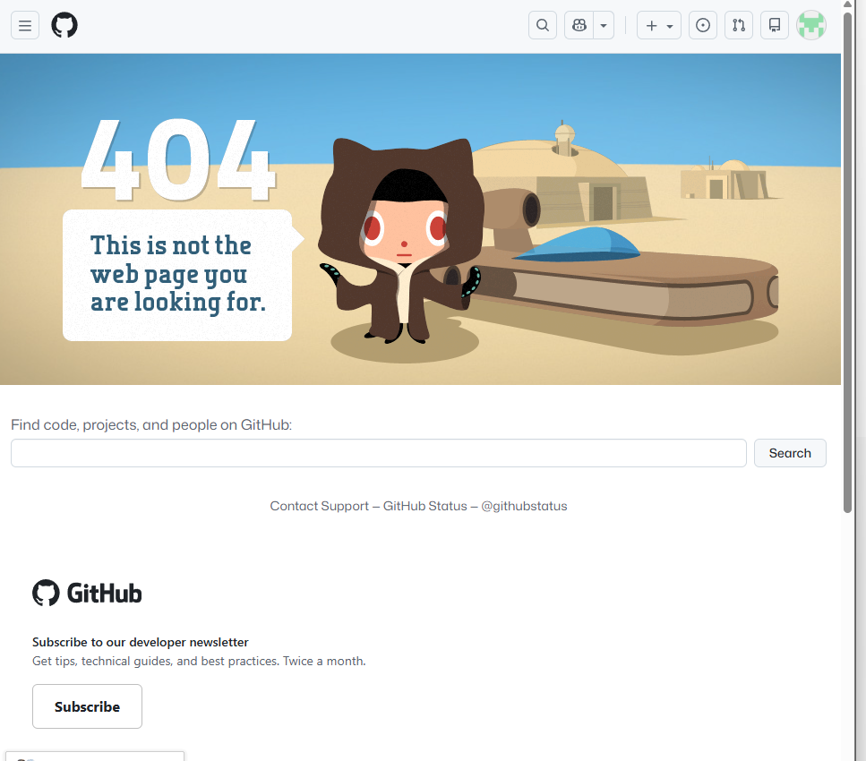
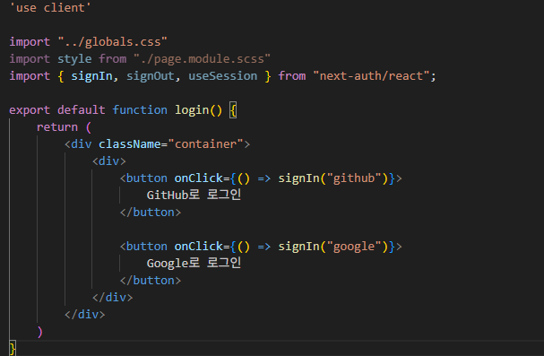
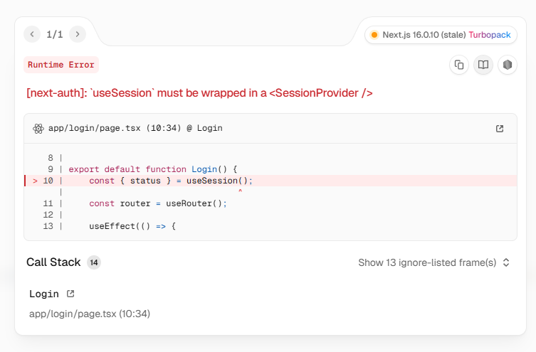
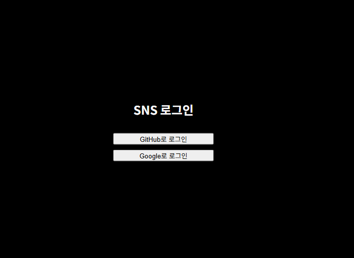
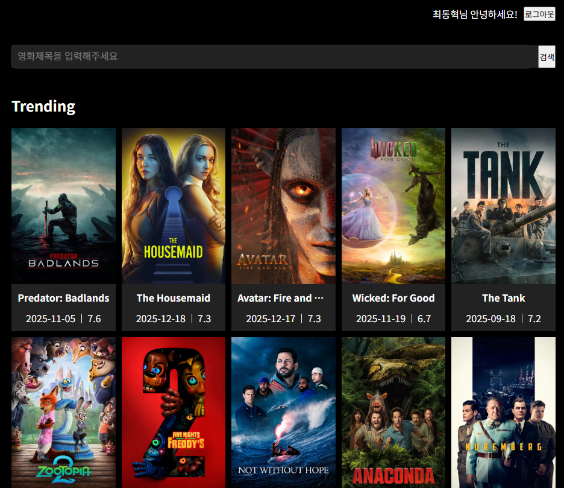

로그인 기능

Nextauth 사용하기

1) 사용이유
1. SNS 로그인을 구현할 수 있는 라이브러리
2. Oauth Provider를 제공해줘서 Oauth 인증 방식으 로그인을 쉽게 구현 (Oauth는 제공자가아닌 제 3자 애플리케이션에게 자신의 정보를 제공하는 인증 프로토콜)
3. OAuth 인증 흐름 처리 (GitHub, Google 등)
4. Access Token / Refresh Token 관리
5. 세션 유지 및 보안 처리
6. CSRF, 쿠키, 콜백 검증

2) 인증 api 구조
src/app/api/auth/[...nextauth]/route.ts

[...nextauth] 사용이유
github 로그인, 콜백처리, 세션 확인, 로그아웃 모든 요청이 /api/auth/* 경로로 들어오기때문

3) NextAuth Route Handler 작성
App Router에서는 API 요청을 HTTP 메서드 단위로 명시

export { handler as GET, handler as POST }; 사용이유
GET : 세션 조회, 로그인 페이지 요청
POST : OAuth 콜백, 로그인 처리

4) 환경변수 필요이유

각 환경변수의 역할

NEXTAUTH_URL
OAuth 콜백 URL 검증 기준

NEXTAUTH_SECRET
세션 암호화 키

보안상 필수
GITHUB_ID / SECRET

GitHub OAuth 인증 정보

5) SessionProvider 필요한 이유
NextAuth는 기본적으로 Context 기반 세션 관리를 사용

6) 로그인 버튼 구현
signIn("github") → OAuth 시작
useSession() → 현재 로그인 상태 확인
signOut() → 세션 삭제

마지막으로 github developer 설정이 안되있어서 애러가 발생.
발급 후 .env.local 수정 -> github 로그인 작동

2026.01.07

기존의 github로그인에 google로그인 추가

순서
1. google OAuth 클라이언트 생성
2. .env.local 클라이언트 ID, 클라이언트 시크릿 추가
3. src/app/api/auth/[...nextauth]/route.ts에 providers에 google 추가
4. loginButton.tsx에 google로그인 버튼 추가

로그인 페이지 분리

1. login directory 생성
2. login page 생성
3. 해당 이미지처럼 sns 로그인 버튼 생성

문제 발생 -> 로그인해도 페이지를 리다이랙트를 안함

로그인 성공하면 main으로 리다이렉트 하는 방법

1. 로그인 페이지에 useSession()을 사용해서 로그인 유무를 확인
(useSession은 loading | authenticated | unauthenticated를 반환)
2. useEffect를 사용해서 로그인 유무를 확인하고 로그인 유무에 따라 페이지를 리다이렉트

해당 에러발생
발생이유 : useSession은 Provider 내부에서 사용되어야 함
해결방법 : layout.tsx에 Provider를 추가 -> 이렇게 해둬야 모든 페이지에서 useSession 사용가능

로그인 페이지가 정상적으로 나옴

로그인 성공 후 google계정 정보를 가져옴